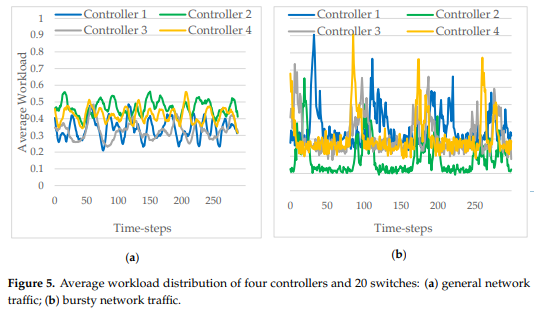
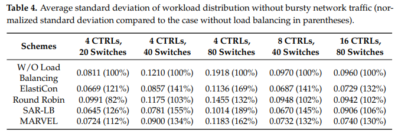
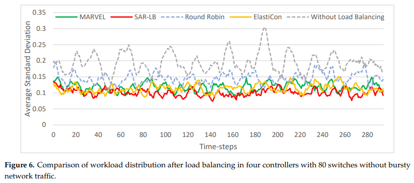
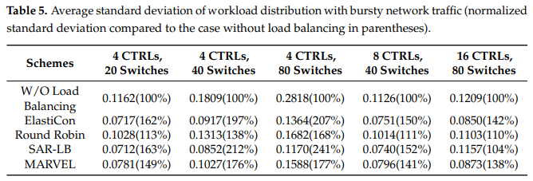
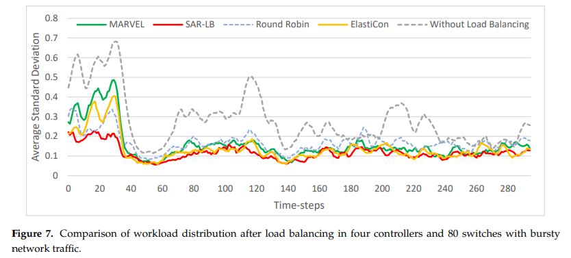
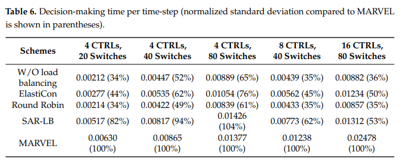

# SAR-LB 

## 1. Motivation
------------------------
* 강화학습 기반의 스위치 마이그레이션 기법은 SDN 컨트롤러의 부하를 분산시키기 위한 방안으로써 연구됨
* 기존 기법의 한계점 
    * 테이블 기반의 강화학습 방법론은 스위치와 컨트롤러의 수가 증가함에 따라 확장성에 한계를 보임
    * 최근 제시된 멀티에이전트 강화학습 기반의 스위치 마이그레이션 기법
      * 컨트롤러가 직접 마이그레이션 할 스위치를 선택하기에는 확장성의 문제가 있으므로, 컨트롤러는 NONE, IMPORT, EXPORT 중 하나의 행위를 선택함. 
       
        &rarr; IMPORT와 EXPORT는 구성된 휴리스틱 알고리즘을 통해 선택된 최선의 스위치를 마이그레이션 대상으로 선택함. 

      * 자원 활용률을 계산하기 위해 CPU, 메모리, 네트워크 활용률로 구성된 선형 수식을 정의함. 그러나, CPU와 메모리와 네트워크 활용률의 경우 항상 일관된 관계를 가지지 않음.

        &rarr; 즉, 선형 수식 내에서 정의된 CPU와 메모리와 네트워크 활용률의 비중(weight)에 의해 현재 자원활용상황에 맞지 않는 행위를 결정할 수 있음.  

## 2. Objective
------------------------
* 휴리스틱한 알고리즘으로 스위치를 선택하지 않고, 강화학습 에이전트가 스위치를 직접 선택할 수 있도록하면서 확장성을 보장하는 방식을 제안
* 자원 활용률을 선형 수식에 의해 정의하지 않고, 신경망에 의해 각 자원 활용률에 대한 중요도를 판단할 수 있도록 수정

-----------------------

## 3. SAR-LB
-----------------------
* "컨트롤러"가 스위치를 선택하지 않고, "스위치"가 컨트롤러를 선택하는 에이전트를 구성. 
  * 일반적으로 SDN 환경에서 컨트롤러의 수는 스위치 대비 상대적으로 적기 때문에 심층강화학습을 통해 학습 가능한 복잡도 유지가능.
* 스위치는 각 컨트롤러의 자원유형별 활용정보를 적충한 상태를 입력값으로 받아 현재 마이그레이션하기 적합한 컨트롤러를 선택함. 
---------------------------------
## 4. Evaluation Results
---------------------
* SDN 환경에 대한 시뮬레이션을 파이썬을 통해 구성
  * 시뮬레이션된 스위치는 포아손 분포를 기반으로 컨트롤러에 대한 워크로드를 구성함. 
* 워크로드는 일반 워크로드와 버스트 워크로드로 나누어 정의함. 
* 컨트롤러 별 워크로드 예시
   </img>

* 로드 밸런싱 성능 분석 결과
  * 일반 부하

</img>

</img>

  * 버스트 부하가 있는 경우

</img>

</img>

  * 두가지 케이스 모두 컨트롤러의 수가 증가함에 따라 제안방식의 효율이 저하됨을 확인함. 
    * 그 이유는 컨트롤러 수의 증가에 따른 상태정보의 크기 및 행위공간의 크기 증가로 인한 학습복잡도의 증가 때문으로 가정됨.  

* Decision-making을 위한 연산 시간 분석
  * 제안 기법이 기존 기법(MARVEL) 대비 연산 시간이 짧지만, 제안 기법의 경우 연산의 병렬화가 어려워 연산 시간에 대한 개선이 필요함. 

</img>